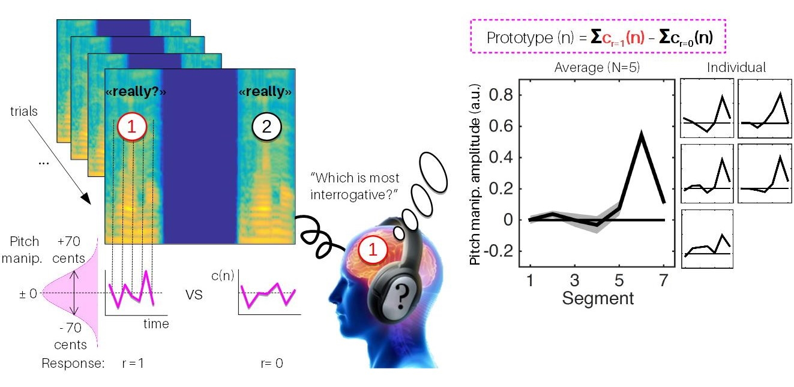
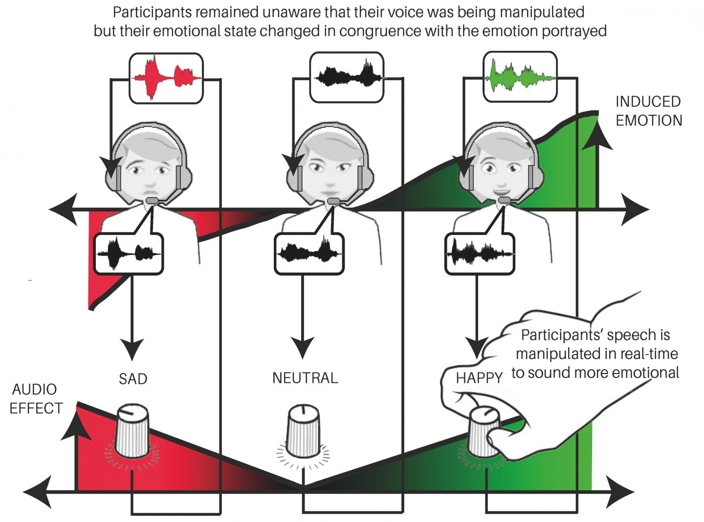

We're an interdisciplinary group of scientists exploring [control-systems](https://en.wikipedia.org/wiki/Control_theory) approaches to the analysis of human sensory electrophysiology. 

The brain is a real-time dynamical system. Yet, [clinical neurophysiology](https://en.wikipedia.org/wiki/Clinical_neurophysiology) (and, in truth, much of cognitive neuroscience, from [ERPs](https://en.wikipedia.org/wiki/Event-related_potential) to [fMRI](https://en.wikipedia.org/wiki/Functional_magnetic_resonance_imaging)) mostly treats it as a static averaging machine, which behavior is analysed and diagnosed from its averaged response over trials rather than from its real-time, single-trial variance.  

_Our vision is to create a control-systems revolution in human clinical neurophysiology_, by bringing to patients automatized stimulation techniques that are able to adapt in real time to their brain dynamics in order to diagnose, prognose and treat neurological and psychiatric disorders. 

Our work is both experimental (we collect our own data, using tools borrowed from the fields of [electrophysiology](https://en.wikipedia.org/wiki/Electroencephalography) and [psychophysics](https://en.wikipedia.org/wiki/Psychophysics)) and computational (we build our own software methods to generate experimental stimuli using [signal processing](https://en.wikipedia.org/wiki/Speech_synthesis) and analyse physiological recordings using data-driven [system modeling](https://en.wikipedia.org/wiki/System_identification)). We work both with healthy participants and patients, but our primary focus is to create the next generation of clinical methods in the fields of [neurology](https://en.wikipedia.org/wiki/Neurology) and [psychiatry](https://en.wikipedia.org/wiki/Psychiatry) for pathologies such as coma, stroke, autism spectrum and post-traumatic stress disorders. 

The Femto neuro group is part of the larger *System Data Science* team, a concentration of 7 faculty working on data-driven analysis, pronostic and health management of natural, industrial and environmental systems (head: Prof. [Jean-Marc Nicod](https://www.femto-st.fr/en/femto-people/jmnicod)), and based in the [Department of Automation and Robotics](https://www.femto-st.fr/en/Research-departments/AS2M/Presentation) of the [FEMTO-ST Institute](https://www.femto-st.fr) (CNRS/Université de Bourgogne Franche-Comté) in Besançon, France. 

## Research

Our current work explores two complementary lines of research:

### Neurophysiological system identification using reverse correlation

In recent years, inspired by work in data-driven face psychophysics by [Rachael Jack](https://www.gla.ac.uk/schools/psychology/staff/rachaeljack) and [Philippe Schyns](https://www.gla.ac.uk/researchinstitutes/neurosciencepsychology/staff/philippeschyns/) at the University of Glasgow, [Frédéric Gosselin](https://recherche.umontreal.ca/nos-chercheurs/repertoire-des-professeurs/chercheur/is/in14360/) at the University of Montreal and others, our lab has developped a new research paradigm combining speech signal processing and psychophysical reverse-correlation ([PNAS 2018](https://www.pnas.org/content/115/15/3972), [Nature Communications 2021](https://www.nature.com/articles/s41467-020-20649-4)). 

{: width="100%" height="100%"}

Our current focus is to extend these approaches to not only reverse-correlate stimulus features on overt behavioural responses, but also on electrophysiological responses extracted from EEG, EMG and autonomic activity. As an application, we are currently collaborating with intensivists at [GHU Paris Psychiatrie et Neurosciences](https://www.ghu-paris.fr/fr/actualites/sounds4care) to construct individualized sound stimuli that are optimized to measure EEG markers of consciousness in comatose patients. 

For this work, we develop and maintain the open-source reverse-correlation toolbox [CLEESE](https://journals.plos.org/plosone/article?id=10.1371/journal.pone.0205943) - see our [Resources page](resources.md) for details. 

### Closed-loop vocal feedback

Another line of research builds on our recently-introduced "vocal feedback" paradigm, in which we use real-time voice technology to let participants read a text out loud while their voice is being manipulated without their knowing. We (with [Petter Johansson](https://www.fil.lu.se/en/person/PetterJohansson/) and [Lars Hall](https://www.fil.lu.se/en/person/LarsHall/) at Lund University, and [Katsumi Watanabe](http://www.fennel.sci.waseda.ac.jp/indexe.html) at Waseda) find that speakers who hear themselves read with a happier or sadder tone of voice also became happier or sadder as a result. ([PNAS 2016](https://www.pnas.org/content/113/4/948), [Consciousness & Cognition 2021](https://www.sciencedirect.com/science/article/abs/pii/S1053810020305390?dgcid=coauthor))

{: width="80%" height="80%"}

Our current focus is to extend this paradigm to "close the loop" and incorporate a feedback controller that is able to adapt the voice transformation to the real-time measure of participant voice. As an application, we are currently collaborating with psychiatrists at the Lille University Hospital and [Centre National de Resources et de Résilience](http://cn2r.fr) to investigate the use of vocal feedback during exposition therapy in post-traumatic stress disorder (PTSD) patients. 

For this work, we develop and maintain the open-source vocal feedback software [DAVID](https://link.springer.com/article/10.3758/s13428-017-0873-y) - see our [Resources page](resources.md) for details. 

## History

The neuro group was established in the FEMTO-ST Institute in Jan. 2021. The group moved from its previous installment as the [CREAM music neuroscience team](http://cream.ircam.fr) at the [Science and Technology of Music and Sound Lab](https://www.stms-lab.fr/) (STMS, IRCAM/CNRS/Sorbonne Université) in [IRCAM](https://www.ircam.fr/), Paris, France. 

[This page](cream.md) archives the CREAM team’s key publications, team members and where each of these people went.