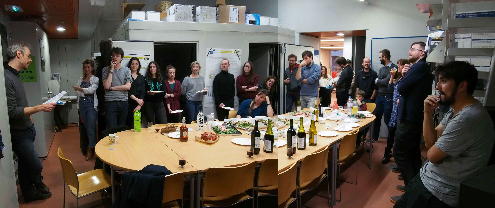
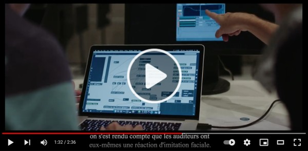
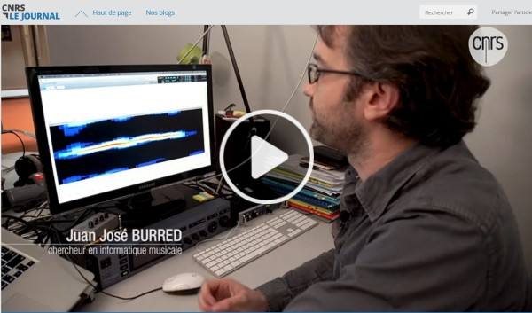

### History 

The neuro group was established in the FEMTO-ST Institute in Jan. 2021. The group moved from its previous installment as the [CREAM music neuroscience team](http://cream.ircam.fr/) (2014-2020) at the [Science and Technology of Music and Sound Lab](https://www.stms-lab.fr/) (STMS, IRCAM/CNRS/Sorbonne Université) in [IRCAM](https://www.ircam.fr/), Paris, France. 

{width="100%" height="100%"}

The CREAM team was originally funded by an ERC Starting Grant (Cracking the Emotional Code of Music - 335536, PI: JJ Aucouturier) and has then received subsequent funding by ANR REFLETS (2017-2021) and Fondation pour l'Audition ([Prix d'Emergence scientifique 2018](https://www.youtube.com/watch?v=toHbRQMHB-w)). 

The research vision of the CREAM team was to bridge over the two disciplines of audio signal processing and cognitive neuroscience/psychology, and turn voice and music into cognitive technologies, with algorithms to create sounds able to selectively activate certain neural pathways, or certain emotions. To this aim, the project introduced several novel methodologies to study the effect of sound on the brain, in the form of acoustic transformation software (SMILE; [DAVID](http://forumnet.ircam.fr/product/david), 2800 downloads as of Jan 2021; [CLEESE](http://forumnet.ircam.fr/product/cleese), 950 downloads; [ANGUS](http://forumnet.ircam.fr/product/angus), 1200 downloads). These technologies formed the basis of experimental research articles notably published in PNAS ([2016](https://www.pnas.org/content/113/4/948); [2018](https://www.pnas.org/content/115/15/3972)), Current Biology ([2018](https://www.cell.com/current-biology/fulltext/S0960-9822(18)30752-8); [2021](https://www.cell.com/current-biology/fulltext/S0960-9822(21)01195-7)) and Nature Communications ([2021](https://www.nature.com/articles/s41467-020-20649-4)). 

[{width="70%" height="70%"}](https://www.youtube.com/watch?v=toHbRQMHB-w)

Over the course of the project (2014-2020), the CREAM team employed more than 15 PhD-level scientists, roughly half of them coming from a computer science or audio engineering background, and the other half from a psychology or cognitive neuroscience background - a diverse, amazing crew of young scientists which have since the end of the project moved on, several of them to start their own independent positions. Beyond academia, the software technologies produced in the project have also been transfered to the voice technology startup [Alta Voce](http://alta-voce.tech), which is now [successfully](https://thenest.webhelp.com/how-can-voice-transformation-impact-your-csat-or-sales-rate/) testing the impact of real-time voice transformation in the field of customer relation. 

[{width="70%" height="70%"}](https://lejournal.cnrs.fr/videos/dis-moi-bonjour-et-je-te-dirai-qui-tu-es)

The CREAM team/project ended in December 2020. This page archives the team's key publications, team members and where each of these people went. The legacy of the CREAM team continues at the FEMTO-ST Neuro group, which was established in the FEMTO-ST Institute in Jan. 2021 on the basis of some of project CREAM's key findings in [psychophysical reverse-correlation](https://www.pnas.org/content/115/15/3972) and [vocal feedback](https://www.pnas.org/content/113/4/948).

<!-- For a lighter viewing, French director [Mailys Audouze](http://www.film-documentaire.fr/4DACTION/w_liste_generique/C_94670_F2)'s 50-min documentary _Cracking my Emotional Code_, premiered at IRCAM in December 2021, followed the team over its 6 years of existence, and gives a rather unique, behind-the-scene glance into how such research was made. -->

### Publications

Click on the {: style="height:20px;width:100px"} banners below for direct access to the PDFs of the papers.

#### 2021

[_Even violins can cry: specifically vocal emotional behaviours also drive the perception of emotions in non-vocal music_](https://royalsocietypublishing.org/doi/10.1098/rstb.2020.0396) 
*Daniel Bedoya*, *Pablo Arias*, *Laura Rachman*, Marco Liuni, Clément Canonne, *Louise Goupil* & *JJ Aucouturier* 
Philosophical Transations of the Royal Society B, vol. 376(1840), 2021  
[{: style="height:20px;width:100px"}](articles/2021/Bedoya_Philosophical_Transactions_2021.pdf)  

[_Facial mimicry in the congenitally blind_](https://www.cell.com/current-biology/fulltext/S0960-9822(21)01195-7) 
*Pablo Arias*, Caren Bellmann & *JJ Aucouturier* 
Current Biology, vol. 31(19), PR1112-R1114 (2021)  
[{: style="height:20px;width:100px"}](articles/2021/Arias_Current_Biology_2021.pdf)  

[_Distinct signatures of subjective confidence and objective accuracy in speech prosody_](https://www.sciencedirect.com/science/article/abs/pii/S0010027721000809) 
*Louise Goupil* & *JJ Aucouturier* 
Cognition, vol. 212, 104661 (2021)  
[{: style="height:20px;width:100px"}](articles/2021/Goupil_Cognition_2021.pdf)  

[_Emergent Shared Intentions Support Coordination During Collective Musical Improvisations_](https://onlinelibrary.wiley.com/doi/abs/10.1111/cogs.12932)  
*Louise Goupil*, Thomas Wolf, Pierre Saint-Germier, *JJ Aucouturier* & Clément Canonne 
Cognitive Science, vol. 45. (2021) 
[{: style="height:20px;width:100px"}](articles/2021/Goupil_Cognitive_Science_2021.pdf)  

[_Vocal signals only impact speakers’ own emotions when they are self-attributed_](https://www.sciencedirect.com/science/article/abs/pii/S1053810020305390?dgcid=coauthor) 
*Louise Goupil*, Petter Johansson, Lars Hall & *JJ Aucouturier*  
Consciousness & Cognition, vol. 88, 103072 (2021) 
[{: style="height:20px;width:100px"}](articles/2021/Goupil_Consciousness_Cognition_2021.pdf)  

[_Listeners perception of certainty and honesty of another speaker is associated with a common prosodic signature_](https://www.nature.com/articles/s41467-020-20649-4) 
*Louise Goupil*, *Emmanuel Ponsot*, Daniel Richardson, Gabriel Reyes & *JJ Aucouturier* 
Nature Communications, vol. 12, 861 (2021) 
[{: style="height:20px;width:100px"}](articles/2021/Goupil_Nature_Communications_2021.pdf)  

#### 2020

[_Beyond Correlation: Acoustic Transformation Methods for the Experimental Study of Emotional Voice and Speech_](https://journals.sagepub.com/doi/10.1177/1754073920934544) 
*Pablo Arias*, *Laura Rachman*, Marco Liuni & *JJ Aucouturier*  
Emotion Review, vol 13 (1), 2020.  
[{: style="height:20px;width:100px"}](articles/2020/Arias_Emotion_Review_2020.pdf)   

[_Realistic manipulation of facial and vocal smiles in real-world video streams_](https://ieeexplore.ieee.org/document/8307228) 
*Pablo Arias*, Catherine Soladié, Oussema Bouafif, Axel Röbel, Renaud Séguier & *JJ Aucouturier*  
IEEE Transactions on Affective Computing, Vol. 11(3), 2020.  
[{: style="height:20px;width:100px"}](articles/2020/Arias_IEEE_TAC_2020.pdf)   

[_Neural entrainment to music is sensitive to melodic spectral complexity_](https://journals.physiology.org/doi/full/10.1152/jn.00758.2018) 
Indiana Wollman, *Pablo Arias*, *JJ Aucouturier* & Benjamin Morillon  
Journal of Neurophysiology, 123(3), 1063-1071, 2020. 
[{: style="height:20px;width:100px"}](articles/2020/Wollman_Neurophysiology_2020.pdf)   

[_Sound context modulates perceived vocal emotion_](https://www.sciencedirect.com/science/article/abs/pii/S0376635719303444) 
*Marco Liuni*, *Emmanuel Ponsot*, Greg Bryant & *JJ Aucouturier* 
Behavioural Processes, vol 172, 104042, 2020 
[{: style="height:20px;width:100px"}](articles/2020/Liuni_Behavioral_Processes_2020.pdf)   

#### 2019

[_Vocal markers of pre-operative anxiety: a pilot study_](https://www.bjanaesthesia.org/article/S0007-0912(19)30509-4/fulltext) 
Gilles Guerrier, *Laurent Lellouch*, *Marco Liuni*, *Andrea Vaglio*, Pierre-Raphaël Rothschild, Christophe Baillard & *JJ Aucouturier* 
British Journal of Anaesthesia, vol 123(4), e486–e488, 2019. 
[{: style="height:20px;width:100px"}](articles/2019/Guerrier_BJA_2019.pdf)   

[_Enjoy The Violence: Is appreciation for extreme music the result of cognitive control over the threat response system?_](https://online.ucpress.edu/mp/article-abstract/37/2/95/109533/Enjoy-The-ViolenceIs-Appreciation-for-Extreme?redirectedFrom=fulltext) 
*Rosalie Ollivier*, *Louise Goupil*, *Marco Liuni* & *JJ Aucouturier*.  
Music Perception, 37(2), 2019 
[{: style="height:20px;width:100px"}](articles/2019/Ollivier_Music_Perception_2019.pdf)  

[_Happy you, happy me: expressive changes on a stranger’s voice recruit faster implicit processes than self-produced expressions_](https://academic.oup.com/scan/article/14/5/559/5482399) 
*Laura Rachman*, Stéphanie Dubal & *JJ Aucouturier* 
Social, Cognitive and Affective Neurosciences (SCAN), vol 14(5), 559–568, 2019. 
[{: style="height:20px;width:100px"}](articles/2019/Rachman_SCAN_2019.pdf)   

[_CLEESE: An open-source audio-transformation toolbox for data-driven experiments in speech and music cognition_](https://journals.plos.org/plosone/article?id=10.1371/journal.pone.0205943) 
*Juan Jose Burred*, *Emmanuel Ponsot*, *Louise Goupil*, *Marco Liuni* & *JJ Aucouturier* 
PLoS one, 14(4), e0205943, 2019 
[{: style="height:20px;width:100px"}](articles/2019/Burred_PLOS_One_2019.pdf)   

[_Musical pleasure and musical emotions (Commentary on Ferreri et al., 2019)_](https://www.pnas.org/content/116/9/3364.short) 
*Louise Goupil* & *JJ Aucouturier* 
Proceedings of the National Academy of Sciences, Vol. 116 (9), 3364-336628, 2019 
[{: style="height:20px;width:100px"}](articles/2019/Goupil_PNAS_2019.pdf)   

#### 2018

[_Auditory smiles trigger unconscious facial imitations_](https://www.cell.com/current-biology/fulltext/S0960-9822(18)30752-8) 
*Pablo Arias*, Pascal Belin & *JJ Aucouturier* 
Current Biology. Vol. 28 (4), PR782-R783, 2018 
[{: style="height:20px;width:100px"}](articles/2018/Arias_Current_Biology_2018.pdf)   

[_Cracking the social code of speech prosody using reverse correlation_](https://www.pnas.org/content/115/15/3972) 
*Emmanuel Ponsot*, *Juan Jose Burred*, Pascal Belin & *JJ Aucouturier* 
Proceedings of the National Academy of Sciences, vol 115 (15) 3972-3977, 2018 
[{: style="height:20px;width:100px"}](articles/2018/Ponsot_PNAS_2018.pdf)  

[_Uncovering mental representations of smiled speech using reverse correlation_](https://asa.scitation.org/doi/10.1121/1.5020989) 
*Emmanuel Ponsot*, *Pablo Arias* & *JJ Aucouturier* 
Journal of the Acoustical Society of America, vol 143 (1), 2018. 
[{: style="height:20px;width:100px"}](articles/2018/Ponsot_JASA_2018.pdf)   

#### 2017

[_Musical friends and foes: the social cognition of affiliation and control in improvised interactions_](https://www.sciencedirect.com/science/article/pii/S0010027717300276) 
*JJ Aucouturier* & Clément Canonne 
Cognition, vol 161, 94–108, 2017 
[{: style="height:20px;width:100px"}](articles/2017/Aucouturier_Cognition_2017.pdf) [{: style="height:20px;width:100px"}](https://archive.org/details/socialmusic)  

[_DAVID: An open-source platform for real-time transformation of infra-segmental emotional cues in running speech_](https://link.springer.com/article/10.3758/s13428-017-0873-y) 
*Laura Rachman*, *Marco Liuni*, *Pablo Arias*, Andreas Lind, Petter Johansson, Lars Hall, Daniel Richardson, Katsumi Watanabe, Stéphanie Dubal & *JJ Aucouturier* 
Behaviour Research Methods, vol. 50(1), 323–343, 2017 
[{: style="height:20px;width:100px"}](articles/2017/Rachman_BRM_2017.pdf)   

#### 2016

[_Emergency medical triage decisions are swayed by computer-manipulated cues of physical dominance in caller’s voice_](https://www.nature.com/articles/srep30219) 
Laurent Boidron, Karim Boudenia, Christophe Avena, Jean-Michel Boucheix & *JJ Aucouturier* 
Scientific Reports vol 6, 30219, 2016 
[{: style="height:20px;width:100px"}](articles/2016/Boidron_Scientific_Reports_2016.pdf)   

[_Covert Digital Manipulation of Vocal Emotion Alter Speakers’ Emotional State in a Congruent Direction_](https://www.pnas.org/content/113/4/948) 
*JJ Aucouturier*, Petter Johansson, Lars Hall, Rodrigo Segnini, Lolita Mercadié & Katsumi Watanabe 
Proceedings of the National Academy of Sciences, vol. 113 no. 4, 2016 
[{: style="height:20px;width:100px"}](articles/2016/Aucouturier_PNAS_2016.pdf)  

### Where are they now 

| Who are they | Were in CREAM as | Where are they now |
| :------------- |:-------------| :-----------|
| [Vasso Zachari](https://ehess.academia.edu/VassoZachari) | Lab manager (2016 - 2020) | PhD Student in Historical anthropology, EHESS, FR |
| [Pablo Arias](https://www.ircam.fr/person/pablo-arias-sarah/) | PhD Student (2014 - 2018) | Postdoc (2019 - 2021) in Petter Johansson's lab @ Lund University, SE |
| [Laura Rachman](https://www.rug.nl/staff/l.rachman/?lang=en) | PhD Student (2014 - 2018) | Postdoc (2019 - 2021) in Deniz Başkent's lab @ University of Groningen, NL |
| [Marco Liuni](https://www.linkedin.com/in/leehooni/) | Postdoc (2014 - 2016), then research scientist (2017-2020) | Co-founder, CPO, [Alta Voce](http://www.alta-voce.tech), Paris, FR |
| [Louise Goupil](https://www.louisegoupil.co.uk/) | Postdoc (2016 - 2020) | CNRS Researcher (chargé de recherche, 2022~) in LPNC (Université Grenoble Alpes/Université Savoie Mont-Blanc), Grenoble, FR |
| [Emmanuel Ponsot](https://scholar.google.fr/citations?user=oCd7k9IAAAAJ&hl=fr) | Postdoc (2016 - 2018) | CNRS Researcher (chargé de recherche, 2022~) in STMS Lab (IRCAM/CNRS/Sorbonne Université), Paris, FR |
| [Beau Sievers](http://beausievers.com/) | Visiting PhD Student (2016) | Postdoc in Thalia Wheatley's lab @ Dartmouth, US |
| [Thomas Wolf](https://somby.ceu.edu/people/thomas-wolf) | Visiting PhD Student (2018) | Postdoc in Natalie Sebanz's and Günther Knoblich's lab in CEU, Vienna, AU |
| [Tomoya Nakai](https://bbl-lab.fr/rushmore_teams/tomoya-nakai/) | Visting PhD Student (2015) | JSPS Postdoc in Jérome Prado's lab, Lyon Neuroscience Research Center, FR| 
| [Andreas Lind](https://www.fil.lu.se/en/person/JOAndreasLind/) | Visiting postdoc (2015-2016) | Visiting Research Fellow, Dept of Cognitive Science, Lund University, SE |
| [Laurent Lellouch](https://www.linkedin.com/in/laurent-lellouch-ba037a150) | Ingénieur d'étude (2019-2020) | Independant music instructor, Montpellier, FR |
| [Daniel Bedoya](http://repmus.ircam.fr/bedoya) | Master student (2019) | PhD Student, STMS Lab (IRCAM/CNRS/Sorbonne Université), Paris, FR |
| [Rosalie Ollivier](https://www.linkedin.com/in/rosalie-ollivier-01666b160/?originalSubdomain=fr)| Master student (2019) | Chargée d'étude de marché, Harris Interactive, Paris FR |
| [Lou Séropian](https://pam-lyon.cnrs.fr/members/lou-seropian/) | Master student (2018) | PhD Student, Lyon Neuroscience Research Center, FR |
| [Andrea Vaglio](https://www.linkedin.com/in/andreavaglio/?originalSubdomain=fr) | Master student (2018) | PhD Student, Deezer, Paris, FR |
| [Mélissa Jeulin](https://www.linkedin.com/in/jeulin-m%C3%A9lissa-678b50b4/?originalSubdomain=fr) | Master student (2017) | Speech and Language Therapist, Paris, FR |
| [Sarah Hermann](https://www.stms-lab.fr/person/sarah-hermann/) | Master student (2016) | Independent music producer |
| [Hugo Trad](https://sciam.fr/fr/equipe/15) | Undergraduate placement student (2016) | Phd Student, SCIAM, Paris, FR |
| [Edgar Hemery](https://www.linkedin.com/in/edgar-hemery-4696726a) | Master student (2014) | Founder, CEO, [Embodme](https://www.embodme.com/) |

