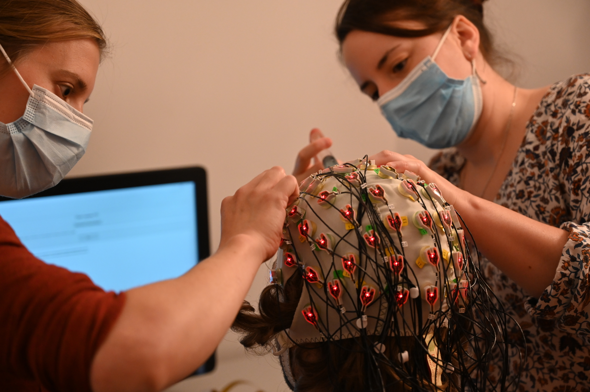

<figure markdown="1">
{: style="height:100%;width:100%;border-radius:1%"}

<figcaption markdown="1">
Creating the next generation of clinical methods for human neurophysiology
</figcaption>

Department of Automation and Robotics (AS2M) 
[FEMTO-ST Institute](http://femto-st.fr/) (CNRS/Université de Bourgogne Franche-Comté) 
24 rue Alain Savary, 25000 Besançon, France

<a href="https://github.com/neuro-team-femto">:material-github:</a>&nbsp;&nbsp;&nbsp;&nbsp;
<a href="mailto:aucouturier@gmail.com">:material-email:</a>
</figure>