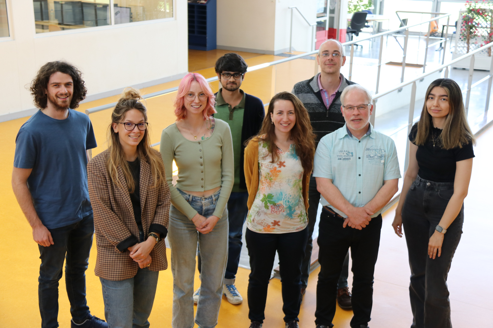

Our group is co-located on two sites, in the FEMTO-ST Institute in Besançon and in Paris, in collaboration with GHU/Hopital Sainte-Anne and ICM/Institut du Cerveau. 

<figure markdown="1">

<figcaption markdown="1">
The Besançon team in May 2023. From left to right: Paul Maublanc, Camille Des Lauriers, Paige Tuttösi, Rudradeep Guha, Coralie Joucla, Jean-Julien Aucouturier, Patrick Nectoux, Aynaz Adl Zarrabi.
</figcaption>
</figure>

### Permanent Staff

<figure>

JJ Aucouturier 
Besançon Team

</figure>

<figure>

Patrick Nectoux 
Besançon Team

</figure>

### Postdoctoral Fellows

<figure markdown="1">

Marie Villain 
Paris Team

</figure>

<figure markdown="1">

Anaïs Llorens 
Paris Team

</figure>

### PhD Students

<figure markdown="1">

Estelle Pruvost-Robieux 
Paris Team

</figure>

<figure markdown="1">

Nadia Guerouaou 
Paris Team

</figure>

<figure markdown="1">

Aynaz Adl Zarrabi 
Besançon Team

</figure>

<figure markdown="1">

Rudradeep Guha 
Besançon Team

</figure>

<figure markdown="1">

Camille Des Lauriers 
Paris Team

</figure>

<figure markdown="1">

Zhenxing Hu 
Besançon Team

</figure>

### Visiting PhD Students & Scholars

<figure markdown="1">

Sarah Benghanem 
Paris Team

</figure>

<figure markdown="1">

Paige Tuttosi 
Besançon Team

</figure>

<figure markdown="1">

Emilie St-Pierre 
Besançon Team

</figure>

### Master Students

<figure>

Umut Kurnaz 
Besançon Team

</figure>

### Alumni

| Who are they | When were they here | Where they went |
| :------------- |:-------------| :-----------|
| Saib Hamouza | Master student (2023) | Continuing studies at Supmicrotech ENSMM, Besançon FR |
| [Paul Maublanc](people/paul_maublanc.md) | Master student (2022), then contract engineer (2022-2023) | PhD student with Boris Kleber, Aarhus University, DK  |
| [Coralie Joucla](people/coralie_joucla.md) | Postdoc, project ANR SEPIA (2022-2023) |  |
| [Alexander Gontran-Massey](https://www.linkedin.com/in/alexander-gontran-massey/) | Master Student (2022) | Continuing studies at ISIFC, Besançon, FR | 
| [Céline Vanney](https://www.linkedin.com/in/celine-vanney) | Master Student (2022) | Continuing studies at ISIFC, Besançon, FR |
| [Quentin Decultot](https://www.linkedin.com/in/quentin-décultot-b41b62202) | Master Student (2021) | Web developper, SOLUTEC, Lyon, FR |
| [Guillaume Denis](https://www.linkedin.com/in/gudenis/) | Senior web developper, project ERC ACTIVATE (2021) | Freelance Web Application Developer, Marseille, FR |

Alumni members of the CREAM team (2014-2020), and where they went next, can be found on the [CREAM](cream.md) history page .  
