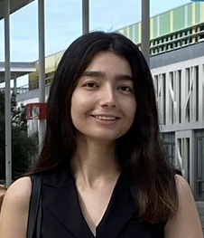

{: style="object-fit: cover;object-position: center top;width: 200px;height: 200px;"}

_PhD Student, FEMTO Neuro group._ 

<a href="mailto:aynaz.adlzarrabi@femto-st.f">:material-email:</a>&nbsp;&nbsp;&nbsp;&nbsp;

  
Aynaz holds a Bachelor's degree in Statistics from the University of Science and Culture in Iran, as well as a Master's degree in Statistics, Computer Science, and Applied Mathematics from the University of Toulouse II in France. 
Her research experience extends beyond pure statistics, as she has contributed to multidisciplinary projects that encompass computer science, applied mathematics, and neuroscience. During her Master's program, she completed research internships in the fields of "Magnetic Resonance in Biology and Medicine" in Marseille and "Speech Understanding Analysis" in Toulouse.
Since May 2022, Aynaz has been a PhD student in our neuro group at the Femto-ST Institute. Her current research focuses on the application of "Psychophysical models in patients with impairments of speech prosody perception in right-hemisphere stroke". In the past year, she has made significant progress in completing a patient's model through the application of Reverse-Correlation methodology and Internal Noise computation.
