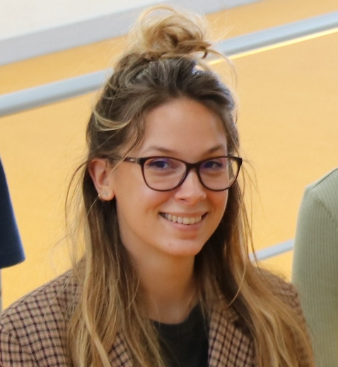

{: style="object-fit: cover;object-position: center top;width: 200px;height: 200px;"}

_PhD student, IPNP & FEMTO-ST Institute_ 

<a href="mailto:camille.des-lauriers@inserm.fr">:material-email:</a>&nbsp;&nbsp;&nbsp;&nbsp;

<!-- I am a PhD student in the [Institut Paris Neurosciences et Psychiatrie](https://ipnp.paris5.inserm.fr/)  (INSERM/Université de Paris) in Paris and a visiting PhD student in the FEMTO Neuro Group. I am also neurologist and intensitivst in a medical ICU ([Cochin Hospital](http://hopitaux-paris-centre.aphp.fr/), APHP, Paris). My main subjects of interest concern the use of neurophysiological markers (i.e EEG and evoked potentials) for neuropronostication after cardiac arrest but also assessment of brain and brainstem dysfunction in critically ill patient, particularly septic patients. -->

