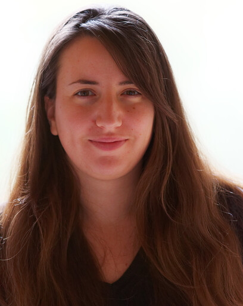

{: style="object-fit: cover;object-position: center top;width: 200px;height: 200px;"}

_Postdoctoral fellow, FEMTO-ST Institute & IRCAM_ 

<a href="mailto:coralie.joucla.pro@gmail.com">:material-email:</a>&nbsp;&nbsp;&nbsp;&nbsp;
<a href="https://github.com/CoraJou">:material-github:</a>&nbsp;&nbsp;&nbsp;&nbsp;

**Office** 
Département AS2M, Institut FEMTO-ST  
ENSMM, 26 rue de l'Epitaphe
25000 Besançon, France

I am a post-doctoral researcher in the FEMTO Neuro Group at the [FEMTO-ST Institute](https://www.femto-st.fr/fr/Departements-de-recherche/AS2M/Presentation) (CNRS/Université de Bourgogne Franche-Comté) and the [Perception and Sounds Design team](https://www.ircam.fr/recherche/equipes-recherche/pds/) (STMS lab/CNRS/Ircam Paris).

After a master’s degree in Neuroscience, Physiology and Behaviour, I obtained my [PhD thesis](http://www.theses.fr/2020UBFCE014) at the University of Bourgogne Franche-Comté under the supervision of [Pr. Emmanuel Haffen](https://www.researchgate.net/profile/Emmanuel-Haffen) (psychiatrist, CHU and INSERM-CIC Besançon), [Dr. Damien Gabriel](http://gabrieldamien.free.fr/) (EEG specialist, INSERM-CIC Besançon) and [Pr. Juan-Pablo Ortega](https://juan-pablo-ortega.com/) (mathematician, University of St. Gallen, Switzerland), with collaboration with [Dr. Lyudmila Grigoryeva](https://scholar.google.fr/citations?user=svYRWEMAAAAJ&hl=fr) (University of Konstanz, Germany).

I work at the interdisciplinarity between neuroscience, neuropsychiatry, EEG, machine learning and data-driven methods, with the objective to gain new insights that can ultimately be used to enhance diagnosis in neurology and psychiatry. While I was mainly trained as a clinical electrophysiologist, I acquired in a short period all the programming background necessary to successfully tackle this kind of problems.

EEG is a common feature in the clinical exploration of brain pathologies, such as sleep, coma or Alzheimer’s disease among others. However, drawing conclusions for individual subjects remains, in most cases, a difficult challenge that shows the limits of presently available information processing techniques. These limitations call for the development of appropriate analysis methods, such as reverse-correlation, that are capable of revealing the stylized features of the neural signal of interest despite the noise in which it is embedded.

My research in this area led to highlighting, through a [systematic review](https://www.biorxiv.org/content/10.1101/2021.12.14.472588v1) of the literature, systemic reproducibility flaws in studies applying SVM to EEG signal. I am therefore very attached to the possibility of respectfully question the results obtained in the laboratory as well as in the literature.

