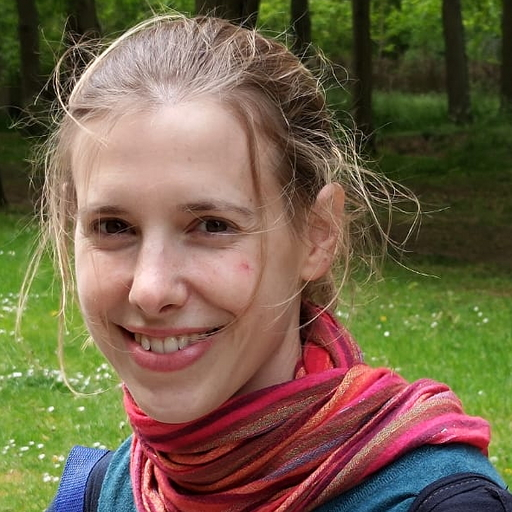

{: style="object-fit: cover;object-position: center top;width: 200px;height: 200px;"}

_Praticien hospitalo-universitaire, Université de Paris & GHU Paris Psychiatrie et Neurosciences._ 
_PhD Student, FEMTO Neuro Group._  

<a href="mailto:Estelle.pruvost-robieux@u-paris.fr">:material-email:</a>&nbsp;&nbsp;&nbsp;&nbsp;

I am a PhD student in the FEMTO Neuro Group (FEMTO-ST Institute, CNRS/Université de Bourgogne Franche-Comté) and in the [Institut Paris Neurosciences et Psychiatrie](https://ipnp.paris5.inserm.fr/) (IPNP / INSERM/Université de Paris). I am also a neurologist, in the neurophysiology department of [GHU Paris Psychiatrie et Neurosciences](https://www.ghu-paris.fr/en) (Sainte Anne Hospital, Paris) where I practice electroneuromyograms, electroencephalograms and evoked potentials for patients with a variety of neurological conditions (peripheral neuropathy, Epilepsy, Disorders of consciousness; etc.)

My doctoral thesis is about the brain integration of various voices expressivities (notably smiling and rough voices) in disorders of consciousness patients. My goal is to improve our knowledge about the cognitive processing of these expressive voice qualities and try to determine if their integration can be a better signature of consciousness than neutral voices. I also study these cerebral pathways with intracerebral recordings performed on conscious pharmacoresistant epileptic patients.

My doctoral thesis is supervised by Pr Martine Gavaret (GHU) and Jean-Julien Aucouturier (FEMTO Neuro Group).

<!-- <i class="fa fa-bar-chart-o" /> [Google Scholar](https://scholar.google.com/citations?user=jnST06UAAAAJ)  
<i class="fa fa-github" /> [Github](https://github.com/jjau)  
<i class="fa fa-twitter" /> [Twitter](https://twitter.com/jjtokyo)  -->
