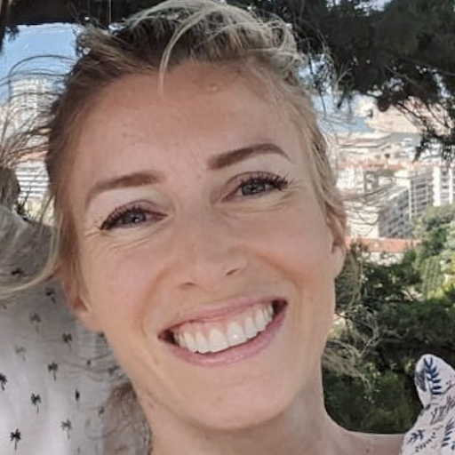

{: style="object-fit: cover;object-position: center top;width: 200px;height: 200px;"}

_Postdoctoral fellow, FEMTO-ST Institute + Brain & Spine Institute_ 

<!-- <a href="mailto:aucouturier@gmail.com">:material-email:</a>&nbsp;&nbsp;&nbsp;&nbsp;
<a href="https://scholar.google.com/citations?user=jnST06UAAAAJ">:simple-googlescholar:</a>&nbsp;&nbsp;&nbsp;&nbsp;
<a href="https://github.com/jjau">:material-github:</a>&nbsp;&nbsp;&nbsp;&nbsp;
<a href="https://twitter.com/jjtokyo">:material-twitter:</a>&nbsp;&nbsp;&nbsp;&nbsp; -->

<!--**Office** 
Département AS2M, Institut FEMTO-ST  
ENSMM, 26 rue de l'Epitaphe
25000 Besançon, France-->

<!--I am a post-doctoral researcher in the FEMTO Neuro Group at the [FEMTO-ST Institute](https://www.femto-st.fr/fr/Departements-de-recherche/AS2M/Presentation) (CNRS/Université de Bourgogne Franche-Comté) and the [Perception and Sounds Design team](https://www.ircam.fr/recherche/equipes-recherche/pds/) (STMS lab/CNRS/Ircam Paris).-->