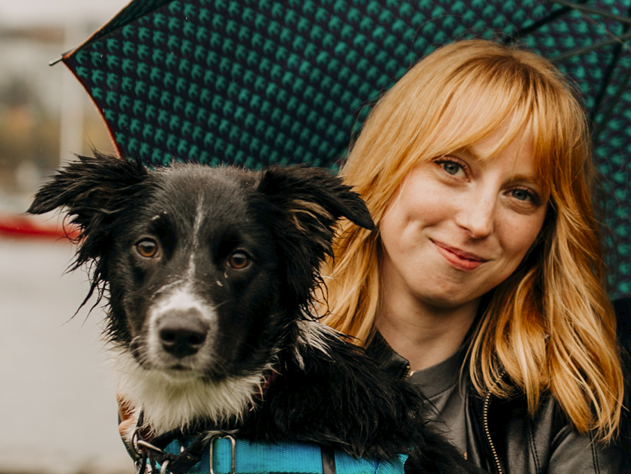

{: style="object-fit: cover;object-position: center top;width: 200px;height: 200px;"}

_PhD student, ROSIE Lab, Simon Fraser University, BC, Canada_ 

<a href="mailto:paige_tuttosi@sfu.ca">:material-email:</a>&nbsp;&nbsp;&nbsp;&nbsp;
<a href="https://scholar.google.com/citations?user=Q9joVUMAAAAJ&hl=en">:simple-googlescholar:</a>&nbsp;&nbsp;&nbsp;&nbsp;
<a href="https://github.com/chocobearz">:material-github:</a>&nbsp;&nbsp;&nbsp;&nbsp;
<a href="https://chocobearz.github.io/">:material-page-layout-body:</a>&nbsp;&nbsp;&nbsp;&nbsp;

I am a PhD student in with the [ROSIE lab](https://www.rosielab.ca/) in the School of Computing Science at Simon Fraser University in Vancouver, Canada. My current research interests are human human robot interaction, technology aided language learning and general contextual improvement of robot voices. Before all of this, I used to be a physical anthropologist and studied Asian religion, then she turned to statistics and computer engineering and dabbled in French the whole way through. When I am not studying, TAing or working too many RAships she likes to ski, dance ballet, compete in agility with her dog and play around with FPGA boards.

I am currently visiting FEMTO-ST as part of my research building better voices for second language teaching robotic assistants. We are using reverse correlation to better understand how words should sound in order to improve memorizations, pronounciation and engagment. If you want to show us your best teaching voice you can contribute to our study [here](https://nowwithfeeling.com/)