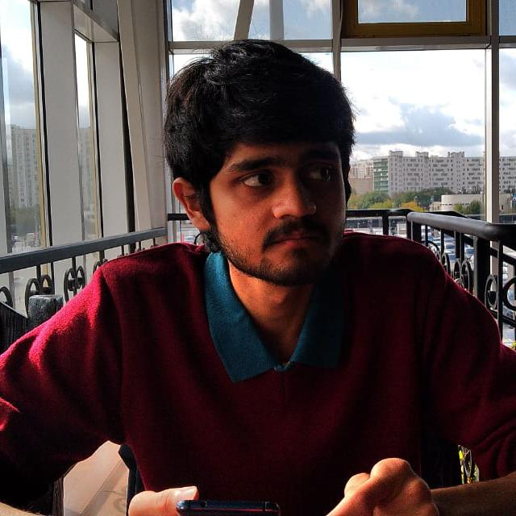

{: style="object-fit: cover;object-position: center top;width: 200px;height: 200px;"}

_PhD Student, FEMTO Neuro group._ 

<a href="mailto:rudradeep.guha@femto-st.fr">:material-email:</a>&nbsp;&nbsp;&nbsp;&nbsp;
<a href="https://github.com/rudradeep4">:material-github:</a>&nbsp;&nbsp;&nbsp;&nbsp;

 
I have a Bachelor's in Computer Science from Ashoka University (New Delhi), and a Master's in Cognitive Science from National Research University - Higher School of Economics (Moscow) where my thesis focused on language acquisition in the brain by studying bilingual populations.  
My research in the Neuro Group combines neurophysiology (electroencephalography, to be specific) with system identification techniques like temporal response functions (TRFs) and reverse correlation.  
While the techniques of reverse correlation and TRFs can be used to study a wide variety of modalities, here in the Neuro Group we specialize in auditory stimuli. By collecting and analyzing EEG data from healthy participants and those with DoCs (disorders of consciousness), we can train a model to predict evoked responses in the brain to a given stimuli. But equally importantly, we can also generate the stimuli from the evoked signals in the brain.  
Apart from being robust methods to study fundamental aspects of cognition such as attention and consciousness, they are also important in a clinical setting where they can be used to evaluate the prognosis of coma patients or their level of consciousness, on the basis of which their standard of care can be improved, and thorny ethical questions answered.