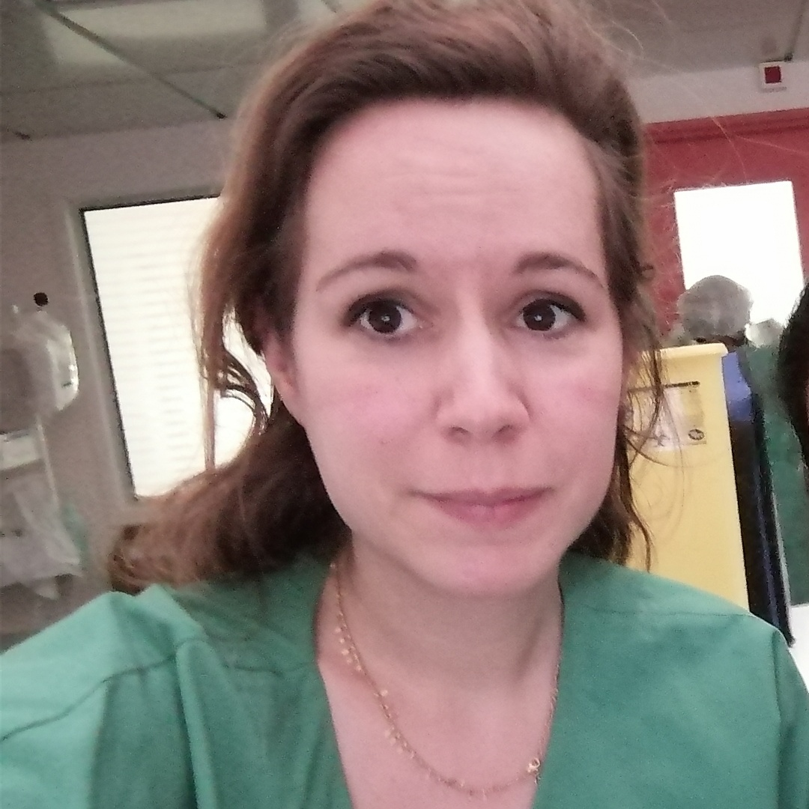

{: style="object-fit: cover;object-position: center top;width: 200px;height: 200px;"}

_Intensivist and neurologist, Cochin Hospital-AP-HP.Centre, Paris University._  
_PhD student, Institut Paris Neurosciences et Psychiatrie IPNP (INSERM/Université de Paris)_ 

<a href="mailto:sarah.benghanem@aphp.fr">:material-email:</a>&nbsp;&nbsp;&nbsp;&nbsp;

I am a PhD student in the [Institut Paris Neurosciences et Psychiatrie](https://ipnp.paris5.inserm.fr/)  (INSERM/Université de Paris) in Paris and a visiting PhD student in the FEMTO Neuro Group. I am also neurologist and intensitivst in a medical ICU ([Cochin Hospital](http://hopitaux-paris-centre.aphp.fr/), APHP, Paris). My main subjects of interest concern the use of neurophysiological markers (i.e EEG and evoked potentials) for neuropronostication after cardiac arrest but also assessment of brain and brainstem dysfunction in critically ill patient, particularly septic patients. 

My doctoral thesis aims to develop a novel approach using emotionnal sound such as the patient's own name pronounced by a familiar voice, or 3D sounds (e.g. looming or receding sources), to increase the clinical (i.e. assessment of consciousness) and prognosis (i.e. prediction of neurological outcome) values of the EEG and evoked potentials markers in comatose patients after cardiac arrest. I also evaluate functional EEG connectivity in a population of healthy participants and a population of pharmacoresistant epileptic patients with intracerebral recording (SEEG), to reveal which cerebral structures are particularly activate by these emotional sounds. 

My doctoral thesis is supervised by Pr Martine Gavaret (IPNP & GHU Paris Psychiatrie et Neurosciences) and Pr Alain Cariou (Medical ICU, Cochin Hospital, APHP).

